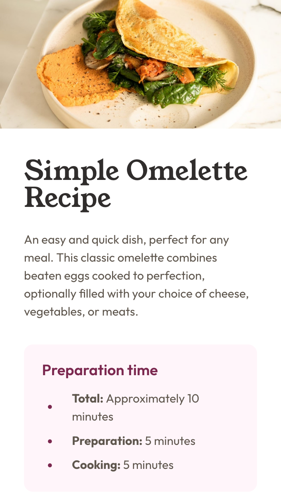

# Frontend Mentor - Recipe page solution

This is a solution to the [Recipe page challenge on Frontend Mentor](https://www.frontendmentor.io/challenges/recipe-page-KiTsR8QQKm). Frontend Mentor challenges help you improve your coding skills by building realistic projects.

## Table of contents

-   [Overview](#overview)
    -   [The challenge](#the-challenge)
    -   [Screenshot](#screenshot)
    -   [Links](#links)
-   [My process](#my-process)
    -   [Built with](#built-with)
    -   [What I learned](#what-i-learned)
    -   [Continued development](#continued-development)
    -   [Useful resources](#useful-resources)
-   [Author](#author)

## Overview

### Screenshot



### Links

-   [Solution on Frontend Mentor](https://www.frontendmentor.io/solutions/simple-solution-using-css-flexbox-DfaZngYsZW)
-   [Live Site](https://gdsimoes.github.io/recipe-pagefro)

## My process

### Built with

-   CSS custom properties
-   Flexbox
-   Mobile-first workflow
-   Variable Fonts

### What I learned

I didn't expect to learn as much from this project as I did. Getting the variable font to work was the greatest challenge and, honestly, neither the spec nor the browsers seem ready to support it. I also learned about the `font-variant-numeric` and got to dive into a lot of font related features and appreciate how complex all the details are.

Another topic that gave me an opportunity to learn was about the `::marker` pseudo-element. It makes it easy to change the color of bullet points and things like that. Unfortunately, it doesn't help with centering the bullet points vertically so I had to use the following trick:

```html
<ul>
    <li>
        <span><b>Total:</b> Approximately 10 minutes</span>
    </li>
    <li><b>Preparation:</b> 5 minutes</li>
    <li><b>Cooking:</b> 5 minutes</li>
</ul>
```

```css
ul li > span {
    display: inline-block;
    vertical-align: middle;
}
```

Finally, I delved into making visually appealing tables accessible to users with disabilities. For such a simple table this might not be necessary, but I took it as an opportunity to learn.

### Continued development

I still want to learn more about modern fonts, specially about optimizing them using frameworks like `Next.js`. Also, I think the trick for aligning bullet points wasn't worth the trouble and I want to learn how to do the same thing using the `::before` pseudo-element.

### Useful resources

-   [Wakamai Fondue](https://wakamaifondue.com/) - This is the website that showed me there were different versions of numbers in the same font I was using.
-   [MDN - `font-variant-numeric`](https://developer.mozilla.org/en-US/docs/Web/CSS/font-variant-numeric) - Once I realized there was such a property I knew I could rely on MDN to get the details down.
-   [ttf to woff2 converter](https://everythingfonts.com/ttf-to-woff2) - I needed a converter that supported variable fonts. I just wish it also removed unnecessary characters to make the filesize even smaller.

## Author

-   Website - <https://gdsimoes.com>
-   Frontend Mentor - [gdsimoes](https://www.frontendmentor.io/profile/gdsimoes)
-   LinkedIn - [gdsimoes](https://www.linkedin.com/in/gdsimoes)
